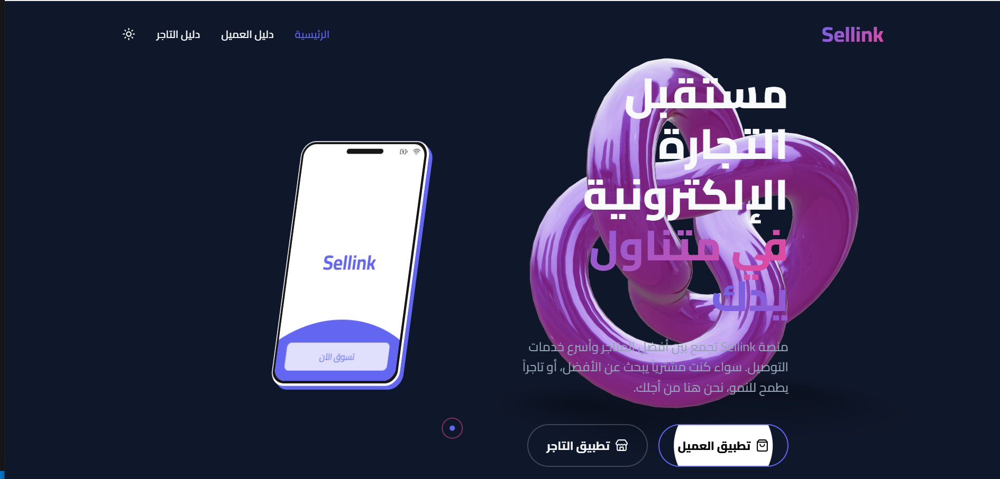
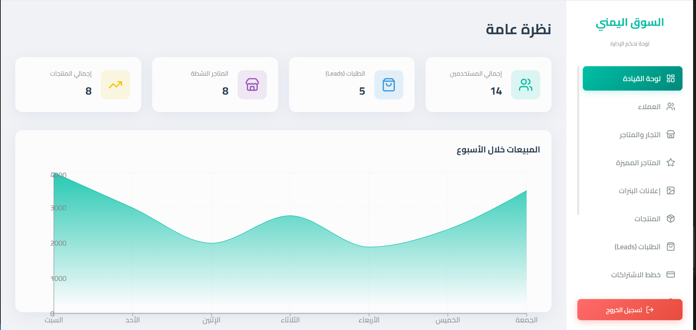
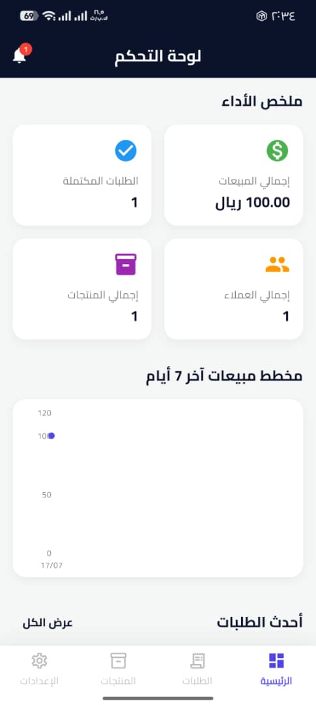
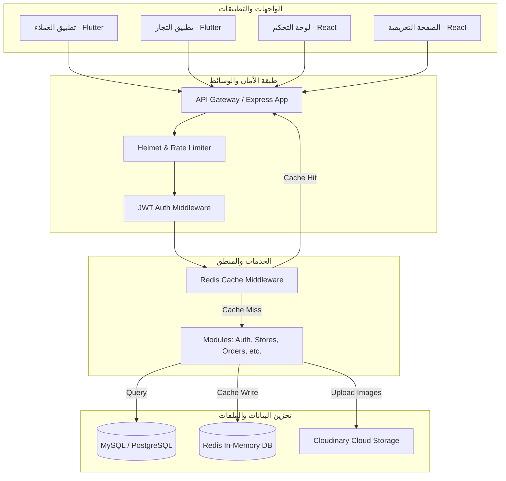

# 🚀 Sellink Platform | منصة سيلينك التجارية المتكاملة

[](https://github.com)
[](https://github.com)
[](https://github.com)
[](LICENSE)

**Sellink** هي منصة تجارة رقمية متكاملة ومصممة خصيصاً لتلبية احتياجات السوق اليمني. تتيح المنصة للتجار إنشاء متاجرهم الخاصة وإدارتها بسهولة، وتوفر للعملاء تجربة تسوق سلسة عبر تطبيقات الهاتف المحمول، بالإضافة إلى لوحة تحكم شاملة لإدارة النظام بالكامل.

---

## 📌 جدول المحتويات (Table of Contents)
1. [مكونات النظام (System Components)](#1-مكونات-النظام-system-components)
2. [معرض واجهات المستخدم (UI Showcase)](#2-معرض-واجهات-المستخدم-ui-showcase)
3. [هيكل مجلدات المشروع (Project Directory Structure)](#3-هيكل-مجلدات-المشروع-project-directory-structure)
4. [بنية النظام وتدفق البيانات (System Architecture & Data Flow)](#4-بنية-النظام-وتدفق-البيانات-system-architecture--data-flow)
5. [الأنظمة والميزات الرئيسية (Key Systems & Features)](#5-الأنظمة-والميزات-الرئيسية-key-systems--features)
6. [توثيق مسارات الـ API (API Endpoints Documentation)](#6-توثيق-مسارات-الـ-api-api-endpoints-documentation)
7. [بنية قاعدة البيانات والعلاقات (Database Schema & Relations)](#7-بنية-قاعدة-البيانات-والعلاقات-database-schema--relations)
8. [الأمان وتحسين الأداء (Security & Performance Optimization)](#8-الأمان-وتحسين-الأداء-security--performance-optimization)
9. [اللغات والتقنيات المستخدمة (Tech Stack & Languages)](#9-اللغات-والتقنيات-المستخدمة-tech-stack--languages)
10. [طريقة التشغيل والتهيئة (Installation & Setup)](#10-طريقة-التشغيل-والتهيئة-installation--setup)
11. [تهيئة البيانات والاختبارات (Seeding & Testing)](#11-تهيئة-البيانات-والاختبارات-seeding--testing)
12. [خطة التطوير المستقبلية (Future Roadmap)](#12-خطة-التطوير-المستقبلية-future-roadmap)

---

## 1. مكونات النظام (System Components)

يتكون مشروع **Sellink** من خمسة أجزاء رئيسية متكاملة تعمل بتناغم تام:

### 🖥️ الخلفية البرمجية (Backend API)
*   **الوصف**: عقل النظام والمحرك الرئيسي لجميع العمليات. تم بناؤه باستخدام **Node.js** و **Express.js** مع هيكلية مقسمة إلى موديولات (Modular Architecture) لتسهيل التطوير والتوسع.
*   **المسار**: `src/`

### 📊 لوحة تحكم الإدارة (Admin Dashboard)
*   **الوصف**: لوحة تحكم شاملة لمدير النظام لإدارة المستخدمين، المتاجر، الاشتراكات، الإعلانات، والتقارير.
*   **التقنية**: **React** + **Vite** + **CSS**.
*   **المسار**: `admin_panel/`

### 🌐 الصفحة التعريفية (Landing Page)
*   **الوصف**: صفحة ويب تفاعلية وديناميكية للتعريف بالمنصة، تحتوي على تأثيرات بصرية حديثة (مثل الهاتف العائم ثلاثي الأبعاد، ومؤشر الماوس التفاعلي، والوضع الداكن/المضيء) مع نظام إدارة محتوى (CMS) داخلي للصفحات القانونية والتعليمية.
*   **التقنية**: **React** + **Vite** + **CSS**.
*   **المسار**: `landing_page/`

### 📱 تطبيق العملاء (Customer Mobile App)
*   **الوصف**: تطبيق هاتف محمول للعملاء لتصفح المتاجر والمنتجات، البحث، إضافة للمفضلة، وإجراء الطلبات وتتبعها.
*   **التقنية**: **Flutter** (Dart).
*   **المسار**: `mobile/customer_app/`

### 💼 تطبيق أصحاب المتاجر (Merchant Mobile App)
*   **الوصف**: تطبيق هاتف محمول مخصص للتجار لإدارة منتجاتهم، طلباتهم، عروضهم، إحصائيات أرباحهم، وإعدادات متجرهم.
*   **التقنية**: **Flutter** (Dart).
*   **المسار**: `mobile/store_owner_app/`

---

## 2. معرض واجهات المستخدم (UI Showcase)

لإعطاء فكرة واضحة عن شكل وتصميم المنصة، تم تنظيم لقطات الشاشة (Screenshots) الخاصة بكل جزء من أجزاء النظام أدناه.

### 🌐 الصفحة التعريفية ولوحة تحكم الإدارة (Landing Page & Admin Dashboard)

| الصفحة التعريفية (Landing Page) | لوحة تحكم الإدارة (Admin Dashboard) |
| :---: | :---: |
|  <br> *تصميم عصري تفاعلي مع تأثيرات بصرية والوضع الداكن* |  <br> *إحصائيات شاملة وإدارة كاملة للمتاجر والاشتراكات* |

### 📱 تطبيقات الهواتف الذكية (Customer & Merchant Mobile Apps)

| تطبيق العملاء (Customer App) | تطبيق التجار (Merchant App) |
| :---: | :---: |
|  <br> *تصفح المتاجر، المنتجات، وإجراء الطلبات* |  <br> *إدارة المنتجات، الطلبات، والإحصائيات* |

---

## 3. هيكل مجلدات المشروع (Project Directory Structure)

يوضح المخطط التالي الهيكل التنظيمي لملفات ومجلدات المشروع:

```text
project-platform/
├── admin_panel/                  # لوحة تحكم الإدارة (React + Vite)
│   ├── src/
│   │   ├── components/           # المكونات المشتركة (الجداول، النوافذ المنبثقة)
│   │   ├── context/              # إدارة الحالة (Authentication Context)
│   │   ├── pages/                # صفحات اللوحة (المتاجر، الاشتراكات، الإعلانات، التقارير)
│   │   ├── App.jsx               # المكون الرئيسي وإعدادات المسارات
│   │   └── main.jsx              # نقطة الدخول للوحة
│   └── package.json
├── landing_page/                 # الصفحة التعريفية للمنصة (React + Vite)
│   ├── src/
│   │   ├── assets/               # الصور والوسائط
│   │   ├── App.jsx               # تصميم الصفحة والأنيميشن والوضع الداكن
│   │   └── index.css             # التنسيقات وتأثيرات الحركة
│   └── package.json
├── mobile/                       # تطبيقات الهواتف الذكية (Flutter)
│   ├── customer_app/             # تطبيق العملاء
│   │   ├── lib/
│   │   │   ├── core/             # الثوابت، الألوان، والثيمات المشتركة
│   │   │   ├── features/         # الميزات (الرئيسية، السلة، الطلبات، المفضلة، الحساب)
│   │   │   └── main.dart         # نقطة انطلاق التطبيق
│   └── store_owner_app/          # تطبيق التجار (أصحاب المتاجر)
│       ├── lib/
│       │   ├── core/             # الإعدادات العامة والاتصال بالـ API
│       │   ├── features/         # الميزات (المنتجات، الطلبات، العروض، الإحصائيات)
│       │   └── main.dart
├── src/                          # الخلفية البرمجية (Node.js + Express)
│   ├── config/                   # إعدادات قاعدة البيانات والـ Redis
│   ├── middleware/               # برمجيات وسيطة (المصادقة، الكاش، معالجة الأخطاء)
│   ├── modules/                  # الوحدات البرمجية المستقلة (Modular Modules)
│   │   ├── auth/                 # نظام التحقق والمصادقة
│   │   ├── stores/               # إدارة المتاجر
│   │   ├── products/             # إدارة المنتجات
│   │   ├── orders/               # إدارة السلة والطلب والتوصيل
│   │   ├── notifications/        # نظام الإشعارات (داخلي + واتساب)
│   │   ├── subscriptions/        # باقات الاشتراك للتجار
│   │   └── analytics/            # الإحصائيات والتقارير
│   ├── app.js                    # إعدادات التطبيق والميدل ويرز
│   ├── routes.js                 # تجميع وتوجيه المسارات
│   └── server.js                 # تشغيل السيرفر والربط بقاعدة البيانات
├── package.json                  # إعدادات وحزم الخلفية البرمجية
└── README.md                     # ملف التوثيق الحالي
```

---

## 4. بنية النظام وتدفق البيانات (System Architecture & Data Flow)

يعتمد النظام على بنية **Client-Server Architecture** حيث تتصل جميع الواجهات والتطبيقات بالخلفية البرمجية عبر **RESTful API** محمي وآمن.



---

## 5. الأنظمة والميزات الرئيسية (Key Systems & Features)

### 🔒 نظام الحماية والمصادقة (Authentication & Security)
*   تسجيل الدخول وإنشاء الحسابات باستخدام رقم الهاتف وكلمة المرور.
*   نظام صلاحيات متكامل (Role-Based Access Control) يفصل بين (المدير Admin، التاجر Store Owner، العميل Customer، المندوب Delivery).
*   تشفير كلمات المرور باستخدام `bcryptjs`.
*   حماية الـ API باستخدام `helmet` لمنع الثغرات الأمنية، و `express-rate-limit` لتحديد معدل الطلبات وحماية النظام من هجمات DDOS.

### 📢 نظام إدارة الإشعارات (Notification Management System)
*   **الإشعارات الداخلية (In-App Notifications)**: إرسال إشعارات فورية للعملاء والتجار عند تغيير حالة الطلب أو إضافة عروض جديدة.
*   **إشعارات الواتساب (WhatsApp Integration)**: إرسال تفاصيل الطلبات والتحديثات مباشرة عبر الواتساب لسهولة التواصل في السوق اليمني.
*   **إشعارات الإدارة**: إرسال إشعارات لمدير النظام عند تسجيل متاجر جديدة أو طلبات دعم.

### 🏪 نظام إدارة المتاجر (Store Management)
*   إنشاء متجر مخصص لكل تاجر يحتوي على (شعار، غلاف، وصف، موقع على الخريطة، ساعات العمل، سياسة التوصيل).
*   رابط فرعي مخصص لكل متجر (Custom Slug) مثل: `sellink.com/store-name`.
*   تحديد رسوم التوصيل بناءً على المدينة والمنطقة.
*   نظام المتاجر المميزة (Featured Stores) لظهور المتاجر في الصفحة الرئيسية.

### 📦 نظام إدارة المنتجات (Product Management)
*   إضافة وتعديل المنتجات مع تحديد السعر، السعر بعد الخصم، المخزون، والوحدة.
*   رفع صور متعددة للمنتج وتخزينها سحابياً باستخدام **Cloudinary**.
*   تقسيم المنتجات حسب التصنيفات (إلكترونيات، ملابس، مطاعم، سوبرماركت، إلخ).

### 🛒 نظام السلة والطلبات (Order & Cart Management)
*   إضافة المنتجات إلى السلة وحساب الإجمالي تلقائياً مع رسوم التوصيل.
*   إنشاء الطلبات وتتبع حالتها (قيد الانتظار، مقبول، قيد التوصيل، مكتمل، ملغي).
*   تحديث حالة الطلب من قبل التاجر وتنبيه العميل فوراً.

### 💳 نظام الاشتراكات (Subscription Plans)
*   **الخطة المجانية (Free)**: تتيح إضافة عدد محدود من المنتجات (10 منتجات).
*   **الخطة الأساسية (Basic)**: تتيح ميزات إضافية مثل الكوبونات والتقارير المتقدمة (حتى 100 منتج).
*   **الخطة المميزة (Premium)**: منتجات غير محدودة، دعم فني 24/7، وأولوية الظهور في المنصة.

### 🎟️ نظام العروض والخصومات والإعلانات (Offers, Coupons & Ads)
*   إنشاء كوبونات خصم مخصصة لكل متجر (نسبة مئوية أو قيمة ثابتة).
*   إدارة الإعلانات والبنرات الترويجية (Banners) من خلال لوحة تحكم الإدارة.

### 📈 نظام التحليلات والتقارير (Analytics & Reports)
*   لوحة تحليلات للتاجر لعرض (أكثر المنتجات مبيعاً، الأرباح اليومية والشهرية، عدد الزوار، وحالة الطلبات).
*   لوحة تحليلات للإدارة لعرض إحصائيات المنصة بالكامل.
*   سجل العمليات (Audit Logs) لمراقبة تحركات المشرفين والمدراء لضمان الأمان.

---

## 6. توثيق مسارات الـ API (API Endpoints Documentation)

تحتوي المنصة على توثيق كامل للـ API باستخدام **Swagger UI** متاح عند تشغيل السيرفر على الرابط `/api-docs`. إليك ملخص لأهم المسارات:

### 🔑 المصادقة (Authentication)
*   `POST /api/v1/auth/register` - تسجيل حساب جديد (عميل أو تاجر).
*   `POST /api/v1/auth/login` - تسجيل الدخول والحصول على رمز الـ JWT.
*   `GET /api/v1/auth/profile` - الحصول على بيانات الحساب الحالي (يتطلب Auth Token).

### 🏪 المتاجر (Stores)
*   `GET /api/v1/stores` - جلب جميع المتاجر النشطة (تدعم الفلترة والبحث والصفحات).
*   `GET /api/v1/stores/:id` - جلب تفاصيل متجر معين.
*   `GET /api/v1/stores/slug/:slug` - جلب تفاصيل المتجر عبر الرابط الفرعي (Slug).
*   `POST /api/v1/stores` - إنشاء متجر جديد (خاص بالتاجر).
*   `PUT /api/v1/stores/:id` - تحديث بيانات المتجر.

### 📦 المنتجات (Products)
*   `GET /api/v1/products` - جلب المنتجات (مع دعم البحث والفلترة حسب السعر والتصنيف).
*   `GET /api/v1/products/:id` - تفاصيل منتج معين.
*   `POST /api/v1/products` - إضافة منتج جديد (يتطلب صلاحية تاجر).
*   `PUT /api/v1/products/:id` - تعديل بيانات المنتج.
*   `DELETE /api/v1/products/:id` - حذف منتج.

### 🛒 السلة والطلبات (Cart & Orders)
*   `GET /api/v1/cart` - جلب محتويات السلة الحالية للعميل.
*   `POST /api/v1/cart/items` - إضافة منتج للسلة.
*   `POST /api/v1/orders` - إنشاء طلب جديد بناءً على محتويات السلة.
*   `GET /api/v1/orders` - جلب قائمة الطلبات (للعميل أو التاجر حسب الصلاحية).
*   `PUT /api/v1/orders/:id/status` - تحديث حالة الطلب (مقبول، قيد التوصيل، مكتمل).

### 📢 الإشعارات (Notifications)
*   `GET /api/v1/notifications` - جلب الإشعارات الخاصة بالمستخدم الحالي.
*   `PUT /api/v1/notifications/:id/read` - تحديد الإشعار كمقروء.

---

## 7. بنية قاعدة البيانات والعلاقات (Database Schema & Relations)

توضح العلاقات التالية كيفية ترابط الجداول الأساسية في قاعدة البيانات:

```text
[Users] (1) <------- (1) [Stores] (1) <------- (Many) [Products]
   │                         │                            │
   │ (1)                     │ (1)                        │ (1)
   ▼                         ▼                            ▼
[Subscriptions]           [Orders] (1) <------- (Many) [OrderItems]
```

### تفاصيل العلاقات (Relations Details):
1.  **المستخدمون والمتاجر (Users & Stores)**:
    *   كل مستخدم لديه دور محدد (`role`). إذا كان الدور `store_owner` فإنه يمتلك متجراً واحداً فقط (`one-to-one`).
2.  **المتاجر والمنتجات (Stores & Products)**:
    *   كل متجر يحتوي على العديد من المنتجات (`one-to-many`). عند حذف المتجر، يتم حذف منتجاته تلقائياً (Cascade Delete).
3.  **المتاجر والطلبات (Stores & Orders)**:
    *   كل طلب يرتبط بمتجر معين لتسهيل إدارة الطلبات من قبل التاجر.
4.  **الطلبات وتفاصيلها (Orders & OrderItems)**:
    *   يحتوي الطلب الواحد على منتج واحد أو أكثر عبر جدول وسيط `OrderItems` الذي يحفظ سعر المنتج وقت الشراء والكمية المطلوبة.
5.  **المدن والمناطق (Cities & Areas)**:
    *   كل مدينة (مثل صنعاء) تحتوي على عدة مناطق (مثل حدة، السبعين)، وكل منطقة تحدد قيمة رسوم التوصيل الخاصة بها بشكل ديناميكي.

---

## 8. الأمان وتحسين الأداء (Security & Performance Optimization)

تم تصميم المنصة لتتحمل أعداداً كبيرة من الطلبات مع الحفاظ على سرعة الاستجابة وأمان البيانات:

### 🚀 تحسين الأداء عبر Redis Caching:
*   يتم تخزين نتائج الاستعلامات المتكررة (مثل قائمة المتاجر المميزة، التصنيفات، والمنتجات الأكثر طلباً) في ذاكرة الـ **Redis**.
*   عند طلب البيانات، يتم جلبها من الـ Redis مباشرة (Cache Hit) في أقل من **5 أجزاء من الثانية** بدلاً من الاستعلام من قاعدة البيانات.
*   يتم إفراغ الكاش تلقائياً (Cache Invalidation) عند إضافة منتج جديد أو تعديل بيانات المتجر لضمان تحديث البيانات للعملاء فوراً.

### 🛡️ التدابير الأمنية (Security Measures):
*   **Rate Limiting**: تحديد حد أقصى للطلبات لكل عنوان IP (مثلاً 1000 طلب كل 15 دقيقة) لمنع هجمات الإغراق.
*   **Helmet Middleware**: إعداد ترويسات HTTP الأمنية لحماية التطبيق من ثغرات XSS و Clickjacking.
*   **Input Validation**: استخدام مكتبة `Joi` للتحقق من صحة البيانات المرسلة في الطلبات قبل معالجتها لمنع حقن الكود (SQL Injection).

---

## 9. اللغات والتقنيات المستخدمة (Tech Stack & Languages)

| المكون (Component) | اللغات (Languages) | التقنيات والمكتبات (Technologies & Libraries) |
| :--- | :--- | :--- |
| **الخلفية البرمجية (Backend)** | JavaScript (Node.js) | Express.js, Sequelize ORM, JWT, Joi, Winston, Swagger |
| **لوحة التحكم (Admin Panel)** | JavaScript (React) | Vite, React Router, Axios, Context API |
| **الصفحة التعريفية (Landing)** | JavaScript (React) | Vite, Vanilla CSS, Custom Animations |
| **تطبيقات الجوال (Mobile)** | Dart | Flutter, Provider/Bloc, Http/Dio, Shared Preferences |
| **قواعد البيانات (Databases)** | SQL, Key-Value | PostgreSQL (الإنتاج), MySQL (المحلي), Redis (الكاش) |

---

## 10. طريقة التشغيل والتهيئة (Installation & Setup)

### المتطلبات الأساسية (Prerequisites)
*   Node.js (v16 أو أحدث)
*   Flutter SDK (v3.0 أو أحدث)
*   MySQL أو PostgreSQL
*   Redis Server (اختياري للكاش)

---

### 🛠️ أولاً: تهيئة الخلفية البرمجية (Backend Setup)

1.  انتقل إلى مجلد المشروع الرئيسي:
    ```bash
    cd project-platform
    ```
2.  قم بتثبيت الحزم البرمجية:
    ```bash
    npm install
    ```
3.  قم بإنشاء ملف `.env` بناءً على `.env.example` وقم بتعبئة البيانات:
    ```env
    PORT=5000
    NODE_ENV=development
    DATABASE_URL=your_postgresql_url # للإنتاج
    DB_HOST=localhost # للمحلي
    DB_USER=root
    DB_PASS=your_password
    DB_NAME=sellink_db
    JWT_SECRET=your_jwt_secret
    REDIS_URL=redis://localhost:6379
    CLOUDINARY_CLOUD_NAME=your_cloud_name
    CLOUDINARY_API_KEY=your_api_key
    CLOUDINARY_API_SECRET=your_api_secret
    ```
4.  تشغيل السيرفر في وضع التطوير:
    ```bash
    npm run dev
    ```

---

### 🖥️ ثانياً: تهيئة لوحة تحكم الإدارة (Admin Panel Setup)

1.  انتقل إلى مجلد لوحة التحكم:
    ```bash
    cd admin_panel
    ```
2.  تثبيت الحزم البرمجية:
    ```bash
    npm install
    ```
3.  تشغيل اللوحة محلياً:
    ```bash
    npm run dev
    ```

---

### 🌐 ثالثاً: تهيئة الصفحة التعريفية (Landing Page Setup)

1.  انتقل إلى مجلد الصفحة التعريفية:
    ```bash
    cd landing_page
    ```
2.  تثبيت الحزم البرمجية:
    ```bash
    npm install
    ```
3.  تشغيل الصفحة محلياً:
    ```bash
    npm run dev
    ```

---

### 📱 رابعاً: تهيئة تطبيقات الجوال (Flutter Apps Setup)

#### تطبيق العملاء (Customer App):
1.  انتقل إلى المجلد:
    ```bash
    cd mobile/customer_app
    ```
2.  تحميل حزم فلاتر:
    ```bash
    flutter pub get
    ```
3.  تشغيل التطبيق:
    ```bash
    flutter run
    ```

#### تطبيق التجار (Store Owner App):
1.  انتقل إلى المجلد:
    ```bash
    cd mobile/store_owner_app
    ```
2.  تحميل حزم فلاتر:
    ```bash
    flutter pub get
    ```
3.  تشغيل التطبيق:
    ```bash
    flutter run
    ```

---

## 11. تهيئة البيانات والاختبارات (Seeding & Testing)

لتسهيل تجربة المنصة واختبارها، تم توفير سكربتات جاهزة لتهيئة قاعدة البيانات بالبيانات التجريبية:

### 🌾 تهيئة البيانات الأساسية (Seed Default Data)
قم بزيارة الرابط التالي بعد تشغيل السيرفر لإنشاء حساب المدير الافتراضي، خطط الاشتراك، التصنيفات، والمدن:
`http://localhost:5000/api/v1/seed-all`

*   **حساب المدير الافتراضي (Admin Credentials)**:
    *   رقم الهاتف: `777777777`
    *   كلمة المرور: `password123`

### 🏪 تهيئة متاجر ومنتجات تجريبية (Seed Dummy Stores & Products)
قم بزيارة الرابط التالي لإنشاء 30 متجراً تجريبياً و 150 منتجاً موزعاً عليها لتجربة التصفح والطلب:
`http://localhost:5000/api/v1/seed-dummy-stores`

*   **حساب التاجر التجريبي (Merchant Credentials)**:
    *   رقم الهاتف: `777000000`
    *   كلمة المرور: `123456`

### 🧪 سكربتات الاختبار الآلي (Automated Test Scripts)
يحتوي المشروع على مجموعة من سكربتات الاختبار للتأكد من سلامة العمليات الأساسية:
*   `node test-full-flow.js`: يختبر دورة حياة النظام بالكامل (تسجيل، إنشاء متجر، إضافة منتج، طلب، وتوصيل).
*   `node test-notifications.js`: يختبر نظام الإشعارات الفورية.
*   `node test-whatsapp.js`: يختبر إرسال رسائل الواتساب التنبيهية.
*   `node test-analytics.js`: يختبر نظام الإحصائيات والتقارير.

---

## 12. خطة التطوير المستقبلية (Future Roadmap)

نسعى لتطوير المنصة باستمرار وإضافة الميزات التالية في التحديثات القادمة:
*   💳 **المحفظة الإلكترونية (E-Wallet)**: دعم بوابات الدفع المحلية في اليمن (مثل كريمي، فلوسك، جوالي) لتسهيل الدفع الإلكتروني.
*   🤖 **الذكاء الاصطناعي لاقتراح المنتجات (AI Recommendations)**: تحليل سلوك العملاء واقتراح المنتجات المناسبة لهم لزيادة المبيعات.
*   📍 **تتبع المندوب المباشر (Live GPS Tracking)**: إتاحة تتبع موقع مندوب التوصيل على الخريطة مباشرة من تطبيق العميل.
*   🗣️ **دعم اللغات المتعددة (Multi-language Support)**: إتاحة تصفح المتاجر والمنتجات باللغتين العربية والإنجليزية بشكل كامل.

---

## 📄 الترخيص (License)
هذا المشروع مرخص بموجب رخصة MIT.
